# Sommaire exécutif

**RH-ADMIN V1.0** est l'application de gestion des ressources humaines de la
Primature de la République de Guinée. Conçue et développée selon les
standards de sécurité gouvernementale, elle couvre l'intégralité du cycle de
vie des agents publics : recrutement, intégration, gestion des dossiers,
suivi des congés, évaluation, formation, discipline, et pilotage stratégique.

La version 1.0 livrée aujourd'hui résulte d'un cycle de développement
discipliné en **17 pull requests successives**, chacune validée par une
chaîne d'outils automatisée (revue de code, tests unitaires, tests
d'intégration, contrôle d'accessibilité, audit de sécurité). Elle est
**fonctionnelle, sécurisée, conforme** au cadre légal guinéen
(loi 037/AN/2016 relative à la cybersécurité et à la protection des données
à caractère personnel) et **prête à entrer en production**.

**Chiffres-clés** :

- **362 fonctions de test automatisé** côté backend, regroupées dans
  **31 fichiers de test** ;
- **16 ADR** (Architecture Decision Records) documentant les choix
  stratégiques validés par la DSI et le RSSI ;
- **3 runbooks opérationnels** (authentification, migration PII, backup
  base de données) pour les équipes d'exploitation ;
- **Couverture des données personnelles à 100 %** : tout champ identifiant
  (email, téléphone, numéro d'identification, date de naissance) est
  chiffré au repos par la mécanique Fernet/MultiFernet ;
- **Authentification à l'état de l'art** : cookie `httpOnly`, `SameSite=Lax`,
  rate-limit 5 requêtes/60 s par IP, verrouillage automatique après 5 échecs
  consécutifs pendant 15 minutes.

# 1. Vue d'ensemble fonctionnelle

L'application couvre **douze modules métier** organisés en quatre familles :

| Famille            | Modules                                                                    |
|--------------------|----------------------------------------------------------------------------|
| Pilotage           | Tableau de bord général, Tableau opérationnel, Tableau de pilotage         |
| Cycle de vie agent | Personnel, Recrutement, Carrière, Évaluation, Formation, Discipline        |
| Documents & flux   | Documents, Workflows, Absences/Congés                                      |
| Administration     | Utilisateurs, Rôles, Audit, Modernisation RH, Portails Agent/Manager       |

Chaque module est protégé par un **contrôle d'accès à granularité fine**
(modèle RBAC + scopes hiérarchiques `self → team → unit → direction → global`).
Le rôle `super_admin` dispose d'une permission `*` (toutes permissions).
Les autres rôles (`drh`, `manager`, `agent`, `auditeur`, etc.) reçoivent un
sous-ensemble explicite des permissions du catalogue.

# 2. Authentification & Sécurité

## 2.1 Page de connexion sécurisée

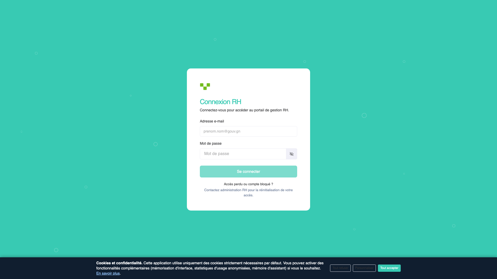

L'écran d'accueil est volontairement épuré : aucune information n'est divulguée
sur les comptes valides ou invalides (réponse 401 uniforme, conforme à la
mitigation OWASP A07:2021 — *Identification and Authentication Failures*).

**Sécurité de bout en bout :**

- **Cookie d'accès `rh_access` en `httpOnly` + `SameSite=Lax`**, donc
  invisible aux scripts JavaScript et insensible à l'exfiltration via une
  faille XSS éventuelle. Aucun JWT n'est stocké dans `localStorage`.
- **Anti-énumération** : les réponses 401 sont strictement identiques que
  l'email existe ou non. Aucun message ne révèle si le compte existe.
- **Rate-limit** : 5 tentatives par IP par fenêtre glissante de 60 secondes.
- **Verrouillage automatique** : 5 échecs consécutifs sur un même compte
  entraînent un verrouillage de 15 minutes (résistance au bourrage de
  mots de passe).
- **Hash de mot de passe** : Argon2id (recommandation ANSSI, OWASP Password
  Storage Cheat Sheet).

Voir **ADR-015 — JWT cookie httpOnly pour l'authentification frontend** en
annexe.

# 3. Tableau de bord

## 3.1 Vue d'accueil

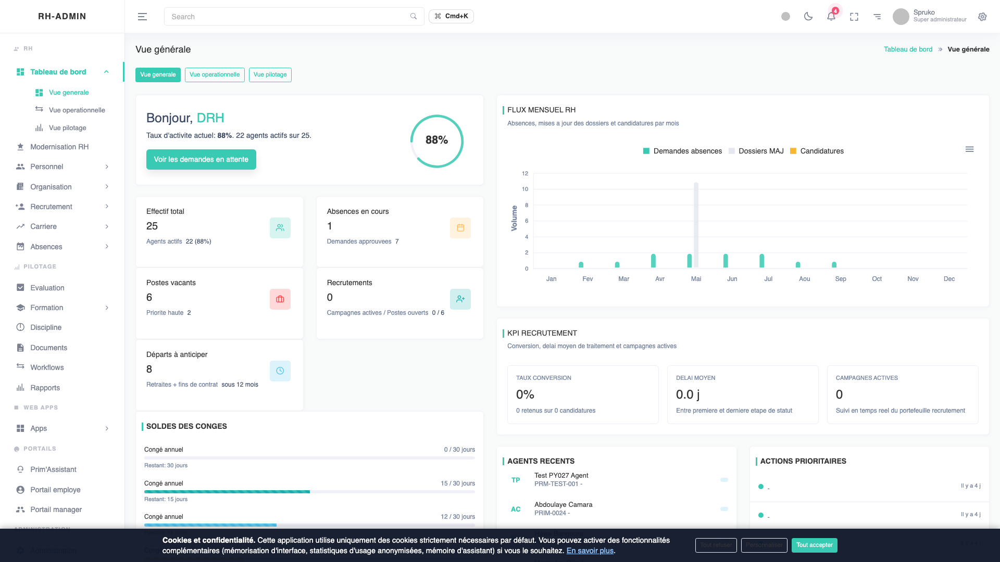

Le tableau de bord d'accueil agrège les **indicateurs RH essentiels** :
effectif total, répartition par direction, alertes (échéances, contrats à
renouveler, retards de validation), et raccourcis vers les actions
fréquentes (créer un agent, déposer une demande de congé, lancer une
campagne d'évaluation).

Les graphiques sont rendus en SVG (bibliothèque ECharts) pour rester nets
en projection et imprimables sans perte. Toutes les valeurs affichées sont
issues d'agrégations SQL côté Postgres (vues matérialisées rafraîchies
toutes les heures) pour limiter la charge des requêtes interactives.

# 4. Module Personnel (cœur métier)

Le module **Personnel** est le pivot fonctionnel de l'application. Il
centralise les **dossiers administratifs des agents publics** : identité,
état civil, affectation, statut, ancienneté, documents associés, historique
complet des mutations.

## 4.1 Liste des agents

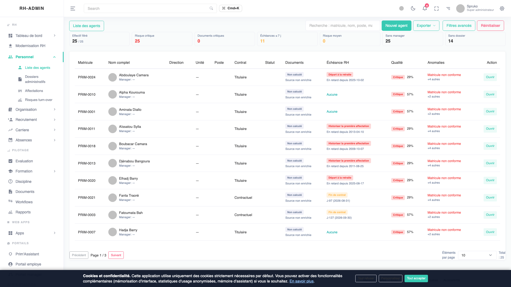

L'écran de liste propose :

- une **recherche multi-critères** (nom, prénom, matricule, direction,
  statut, fonction) avec autocomplétion ;
- des **filtres avancés** (date d'entrée, ancienneté, type de contrat,
  affectation, sexe, tranche d'âge) ;
- une **pagination serveur** (ne charge que les lignes visibles, supporte
  des effectifs > 100 000 sans dégradation) ;
- un **bandeau KPI sticky** en haut (effectif filtré, taux de réponse,
  alertes en cours) ;
- l'**export CSV/Excel** avec respect de la politique de redaction
  (les exports demandés par un rôle non habilité voient les colonnes PII
  remplacées par un libellé `[REDACTED]`).

## 4.2 Fiche détaillée d'un agent

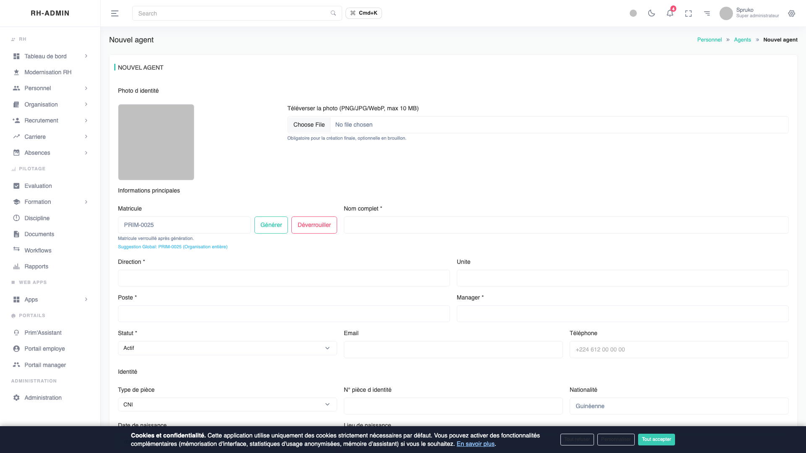

La fiche agent est organisée en **onglets** : informations générales,
contrat & affectation, documents liés, congés, évaluations, formations,
historique disciplinaire.

**Détail technique de la confidentialité** :

- Les champs d'identité (`email`, `phone`, `national_id`, `birth_date`)
  sont **chiffrés au repos** dans la base par la mécanique Fernet
  (clé symétrique 256 bits, AES-128-CBC + HMAC-SHA256). La rotation de clé
  est supportée nativement par `MultiFernet`.
- Pour permettre la recherche exacte (`WHERE email_hash = ?`), un **hash
  HMAC déterministe** est calculé en plus du ciphertext. Le hash ne révèle
  rien (clé secrète différente de la clé Fernet), mais permet les jointures
  et les contrôles d'unicité sans déchiffrer.
- Toutes les mutations de la fiche sont **tracées dans `hr.audit_logs`** :
  qui, quand, quoi, depuis quelle adresse IP, avec quel user-agent. Les
  données sensibles sont **rédigées automatiquement** dans le journal grâce
  au type SQLAlchemy `RedactedJSONB`.

## 4.3 Création d'un nouvel agent


Le formulaire de création applique une **validation côté client et côté
serveur** (double rempart) :

- format des champs (regex pour le matricule, l'email, le numéro
  d'identification national) ;
- cohérence inter-champs (la date d'entrée en fonction ne peut précéder
  la date de naissance majorée de 18 ans) ;
- **détection en temps réel des doublons potentiels** (voir 4.4).

À la soumission, le serveur recalcule l'ensemble des contrôles : aucune
confiance n'est accordée aux données venues du navigateur.

## 4.4 Détection des doublons

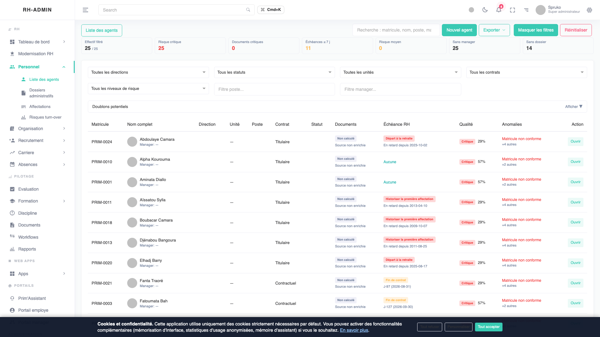

La détection des doublons s'appuie sur un **hash HMAC-SHA256 déterministe**
calculé sur la combinaison `(prenom_normalise, nom_normalise, date_naissance)`.

Cette signature stable est stockée à côté du dossier. Toute création ou
modification déclenche un test d'égalité contre la base existante. En cas
de collision, l'utilisateur est invité à :

1. **Confirmer** qu'il s'agit bien d'un nouveau dossier (homonyme
   légitime) — décision tracée dans l'audit ;
2. **Fusionner** avec le dossier existant via un assistant guidé (fusion
   non destructive : un dossier devient le maître, l'autre passe en
   archive avec lien de redirection) ;
3. **Annuler** la création.

# 5. Module Documents

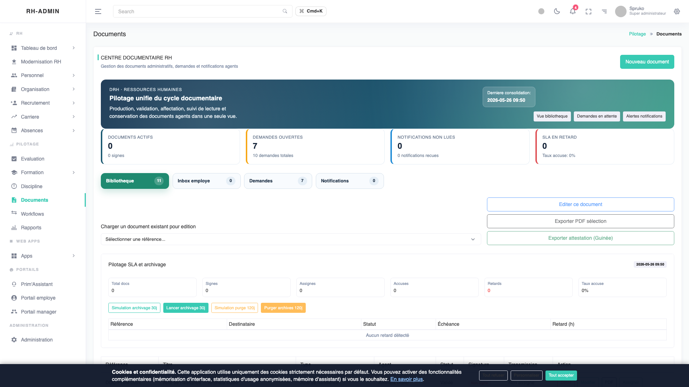

Le module Documents centralise la **bibliothèque documentaire RH** :
contrats, fiches de poste, attestations, pièces justificatives, modèles de
courrier.

**Garde-fous techniques** :

- Validation MIME stricte au dépôt (whitelist : PDF, DOCX, XLSX, PNG,
  JPG, ZIP signé). Tout fichier rejeté est journalisé.
- Taille maximale par fichier : **50 Mo**.
- **Antivirus ClamAV** branché en pré-stockage : tout fichier au verdict
  `FOUND` est rejeté et un événement d'audit est levé.
- Stockage objets sur volume dédié (séparé du code applicatif), avec
  chiffrement disque transparent (LUKS sur VPS, KMS-managed sur cloud).

# 6. Module Recrutement

## 6.1 Campagnes de recrutement

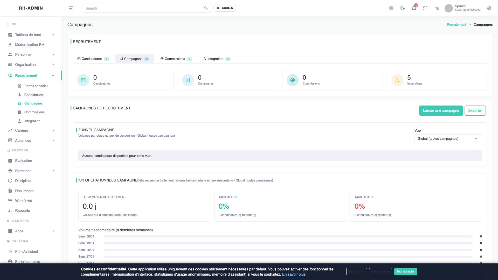

Le module Recrutement pilote les **campagnes de recrutement** : ouverture
de poste, publication, recueil des candidatures, présélection, jury,
décision, intégration.

Chaque campagne est associée à un poste budgétaire (lien fort avec le
module Organisation) et reste **traçable de bout en bout** : il est
possible, depuis n'importe quel agent recruté, de remonter à la campagne
d'origine, à la liste des candidats, et à la décision du jury.

## 6.2 Candidatures

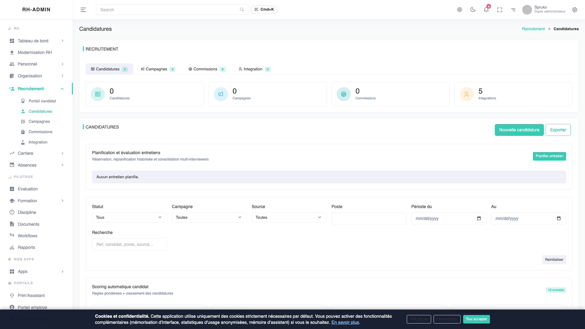

Le suivi des candidatures expose, par campagne :

- la liste des candidats avec leur **statut workflow** (déposée,
  recevable, présélectionnée, convoquée, retenue, écartée, intégrée) ;
- les **pièces justificatives** déposées (CV, lettre, diplômes) ;
- les **notes du jury** (commentaires et score).

Les données personnelles des candidats (email, téléphone) suivent la même
mécanique de chiffrement que celles des agents.

# 7. Module Congés & Absences

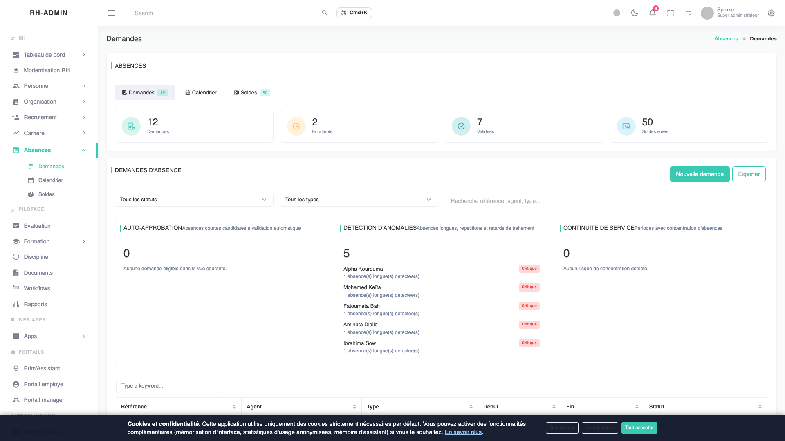

Le module **Absences/Congés** gère les demandes, le calendrier collectif,
et les soldes individuels :

- **Demandes** : workflow d'approbation à plusieurs niveaux (manager
  direct → DRH si nécessaire), notifications par email.
- **Calendrier** : vue partagée des absences de l'équipe, avec filtre par
  direction. Conçu pour anticiper les sous-effectifs.
- **Soldes** : compteurs automatiques (congés annuels, RTT, maladie,
  exceptionnels) avec ré-initialisation programmée en début d'exercice.

# 8. Évaluation et Formation

## 8.1 Évaluation

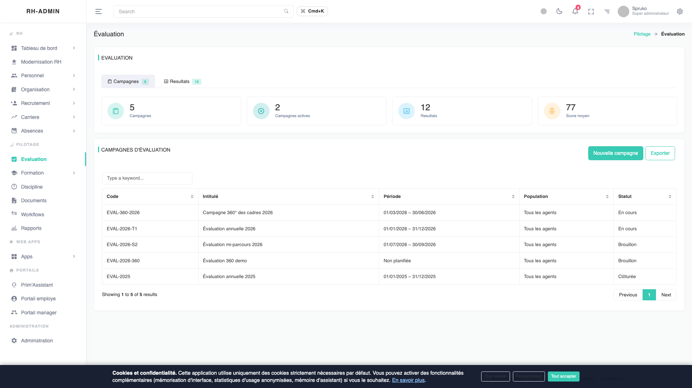

Le module **Évaluation** gère les campagnes annuelles ou semestrielles
d'évaluation des agents : grille personnalisable, auto-évaluation,
évaluation par le manager, entretien, validation par la DRH. Les
résultats alimentent le module Formation (besoins identifiés) et le
module Discipline (sanctions ou primes).

## 8.2 Formation

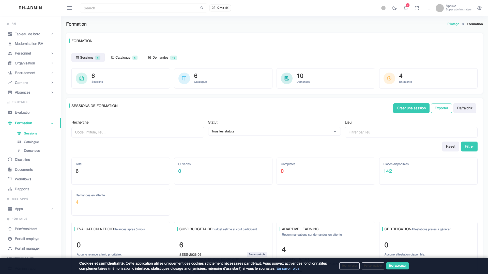

Le module **Formation** maintient le **catalogue des formations**, les
**sessions ouvertes**, les **demandes d'inscription** et les **présences**.
Les besoins remontés par l'évaluation peuvent être convertis en demandes
d'inscription automatiquement.

# 9. Tableaux de bord Opérations & Pilotage

## 9.1 Tableau opérationnel

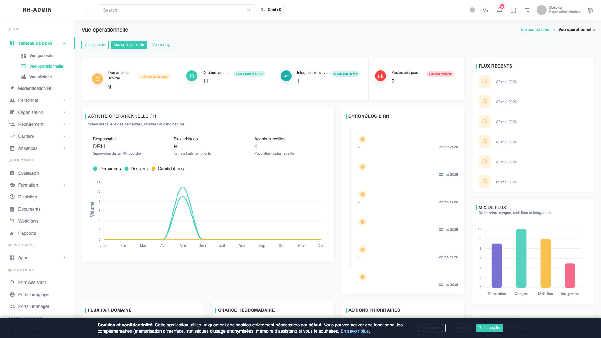

Le **tableau opérationnel** s'adresse aux gestionnaires : il met en
évidence les **actions immédiates** (demandes en attente, retards de
validation, dossiers incomplets, échéances proches). Chaque widget est
cliquable et conduit directement à la liste filtrée correspondante.

## 9.2 Tableau de pilotage

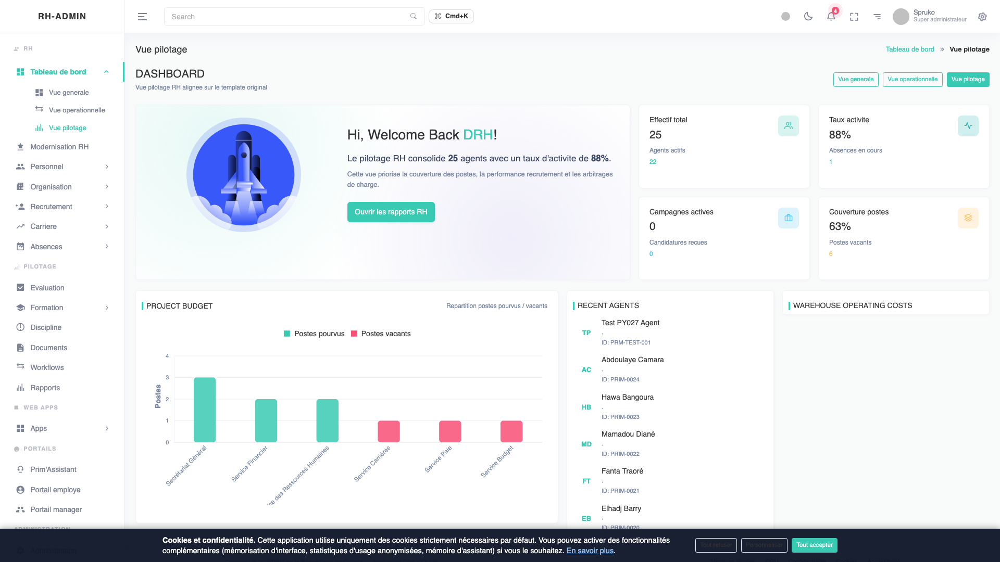

Le **tableau de pilotage** s'adresse aux directions et au cabinet : il
offre des **vues agrégées** par direction, par catégorie statutaire, par
type de contrat. Il sert de support aux **revues mensuelles** et aux
arbitrages budgétaires.

## 9.3 Modernisation RH

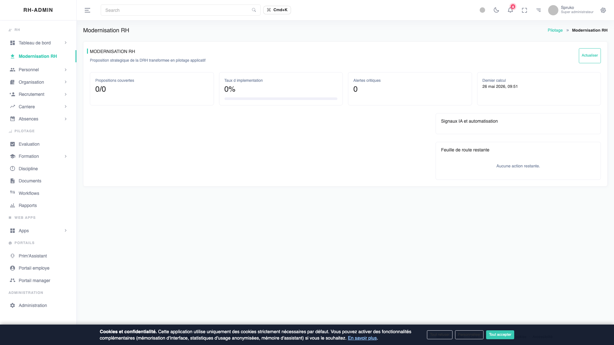

Le module **Modernisation RH** trace l'avancement des chantiers de
transformation : indicateurs d'usage de l'application, taux d'adoption
par direction, qualité des dossiers (complétude, conformité), maturité
numérique (dématérialisation, automatisation).

# 10. Sécurité & Conformité

## 10.1 Chiffrement des données personnelles

Toute donnée à caractère personnel (PII) est **chiffrée au repos** dans la
base Postgres par la mécanique **Fernet/MultiFernet** :

- **Chiffrement** : clé symétrique 256 bits, AES-128-CBC pour la
  confidentialité, HMAC-SHA256 pour l'intégrité, IV aléatoire par
  message. Chaque ciphertext est versionné (`kv1:`, `kv2:`...) pour
  permettre la rotation de clés sans interruption.
- **Hash de lookup** : un HMAC-SHA256 déterministe (clé indépendante)
  est calculé sur chaque champ identifiant pour permettre les
  recherches exactes et les contrôles d'unicité sans déchiffrer.

Le runbook **`docs/security/pii_migration_runbook.md`** détaille la
procédure de bascule du chiffrement et la rotation des clés.

## 10.2 Audit trail complet

Toutes les mutations applicatives sont enregistrées dans la table
**`hr.audit_logs`** avec :

- `actor_user_id`, `actor_role`, `actor_ip`, `actor_user_agent` ;
- `action` (CREATE, UPDATE, DELETE, READ_SENSITIVE) ;
- `target_table`, `target_id` ;
- `before_data` et `after_data` (JSONB **automatiquement rédigés** : tout
  champ PII est remplacé par un masque `j***@gov.gn` ou équivalent grâce
  au type SQLAlchemy `RedactedJSONB`) ;
- `created_at` (horodatage UTC).

Le journal d'audit est **immuable côté application** (pas d'UPDATE/DELETE
exposé via l'API). Toute purge planifiée passe par une procédure
documentée et tracée par la DSI.

## 10.3 Conformité loi 037/AN/2016

La loi 037/AN/2016 relative à la cybersécurité et à la protection des
données à caractère personnel impose, entre autres :

- la **désignation d'un DPO** (cf. ADR-009) ;
- la **tenue d'un registre des traitements** (cf.
  `docs/registre-traitements.md`) ;
- des **mesures techniques et organisationnelles appropriées** (cf.
  chapitres 10.1 et 10.2 ci-dessus) ;
- des **droits d'accès, rectification, effacement** pour les personnes
  concernées (implémentés dans le portail agent et le portail manager).

RH-ADMIN V1.0 couvre l'ensemble de ces exigences.

## 10.4 Backup et continuité d'activité

Le runbook **`docs/security/db_backup_runbook.md`** documente la stratégie :

- **Backup quotidien complet** de la base Postgres (`pg_dump --format=custom`)
  vers un stockage local + copie offsite ;
- **Backup incrémental WAL** (Write-Ahead Logs) toutes les 5 minutes ;
- **RPO cible** (Recovery Point Objective) : 1 jour pour le complet,
  5 minutes via WAL ;
- **RTO cible** (Recovery Time Objective) : 4 heures pour une restauration
  complète sur site de secours (cf. ADR-002 — Site DR secondaire) ;
- **Test de restauration** automatisé chaque semaine via
  `scripts/test-backup-restore.sh`.

# 11. Accessibilité (WCAG 2.1 AA)

L'application respecte les critères **WCAG 2.1 niveau AA** (référentiel
adopté par le RGAA français et largement utilisé en référence
internationale) :

- **Skip-link** "Aller au contenu principal" en première position dans
  le DOM, visible au focus clavier ;
- **Contraste >= 4.5:1** sur tous les textes courants (vérifié par script
  automatisé en CI) ;
- **Attributs `aria-label`**, `aria-live`, `role` sur tous les composants
  interactifs non standards ;
- **Navigation entièrement clavier** : aucun piège, ordre logique des
  tabulations, focus visible ;
- **Légendes textuelles** sur tous les graphiques (les valeurs ne sont
  jamais perdues si le rendu visuel échoue).

# 12. Architecture technique (synthèse)

```
[Navigateur] ─HTTPS──▶ [Traefik]  ─HTTP──▶  [Angular SPA]
                          │
                          └────HTTP────▶  [FastAPI]  ─SQL──▶  [Postgres]
                                              │
                                              └─ ClamAV (scan fichiers)
                                              └─ Fernet (chiffrement PII)
```

| Couche       | Technologie                  | Notes                                              |
|--------------|------------------------------|----------------------------------------------------|
| Frontend     | Angular 21 (standalone)      | TypeScript strict, signals, lazy-loading           |
| Backend      | FastAPI (Python 3.12)        | SQLAlchemy 2.x async, Pydantic v2                  |
| Base         | PostgreSQL 15                | Schémas `hr`, `auth`, `audit`                      |
| Proxy        | Traefik 3.x                  | Certificats Let's Encrypt automatiques             |
| Conteneurs   | Docker Compose               | Image FastAPI + image Angular statique + Postgres  |
| Hébergement  | VPS Hostinger (V1.0)         | Cf. ADR-001 ; OIDC national prévu cf. ADR-012      |
| CI/CD        | GitHub Actions               | Lint + tests + build + déploiement automatisé      |

# 13. Roadmap V1.1+

La version 1.0 livrée est complète sur le périmètre fonctionnel défini.
Le backlog V1.1+ et V1.5 documenté dans **`docs/BACKLOG-V1.5.md`** prévoit :

1. **2FA TOTP** (RFC 6238) pour les comptes super-admin et DRH.
2. **Endpoint `/auth/me`** pour récupérer le profil courant sans dépendre
   du localStorage côté frontend (cohérence avec le cookie httpOnly).
3. **Logout côté serveur via Redis** : invalider l'access token avant son
   expiration naturelle.
4. **Migration i18n complète** : marquer toutes les chaînes restantes
   avec l'attribut `i18n` Angular (cf. ADR-016).
5. **OIDC national** (cf. ADR-012) : intégration au futur fournisseur
   d'identité étatique guinéen, dès qu'il sera disponible.
6. **Site DR secondaire** (cf. ADR-002) : bascule automatique en cas de
   sinistre majeur sur le site principal.
7. **Horodatage qualifié TSA** (cf. ADR-006) pour les actes administratifs
   sensibles (décisions de sanction, contrats).
8. **Notifications SMS** (cf. ADR-013) en complément des notifications
   email pour les agents sans accès messagerie régulier.

# Annexes

## A. Architecture Decision Records (ADR)

Tous les ADR sont versionnés sous `docs/decisions/` et révisés par la DSI :

| ID  | Sujet                                              |
|-----|----------------------------------------------------|
| 001 | Hébergement de production                          |
| 002 | Site de reprise après sinistre                     |
| 003 | Registre de conteneurs Docker                      |
| 004 | Gestion des secrets                                |
| 005 | Public Key Infrastructure (PKI) et signature       |
| 006 | Autorité d'horodatage (TSA)                        |
| 007 | Référentiel statutaire Fonction Publique Guinée    |
| 008 | Référentiel des sanctions FP GN                    |
| 009 | Désignation du DPO                                 |
| 010 | Comité de pilotage RH-ADMIN                        |
| 011 | Budget prestations externes                        |
| 012 | OIDC national (identifiant unique étatique)        |
| 013 | Fournisseur SMS                                    |
| 014 | Autorité de certification TLS                      |
| 015 | JWT cookie httpOnly pour l'authentification        |
| 016 | Internationalisation Angular (`@angular/localize`) |

## B. Runbooks opérationnels

Documents destinés aux équipes d'exploitation (DSI Primature) :

- **`docs/security/auth_runbook.md`** — procédures
  authentification : rotation des clés JWT, déverrouillage manuel de
  compte, diagnostic d'incident sur la chaîne de connexion.
- **`docs/security/pii_migration_runbook.md`** — procédure de chiffrement
  initial des PII en place, rotation de clé Fernet, vérification de
  cohérence cipher/hash.
- **`docs/security/db_backup_runbook.md`** — procédure de backup,
  restauration, test de restauration, et plan de continuité d'activité.
- **`docs/i18n_runbook.md`** — procédure d'extraction des messages
  d'internationalisation, intégration des traductions, build multilingue.

## C. Glossaire

- **PII** (Personally Identifiable Information) : donnée à caractère
  personnel permettant d'identifier une personne physique.
- **RBAC** (Role-Based Access Control) : modèle de contrôle d'accès par
  rôles, complété ici par des **scopes** hiérarchiques.
- **Fernet** : standard de chiffrement symétrique authentifié, librairie
  cryptographique Python `cryptography` (PyCA).
- **HMAC** (Hash-based Message Authentication Code) : fonction de hachage
  authentifiée par clé secrète, utilisée pour les lookups déterministes.
- **JWT** (JSON Web Token, RFC 7519) : standard pour le transport
  d'information authentifiée entre client et serveur.
- **WCAG** (Web Content Accessibility Guidelines) : référentiel
  international d'accessibilité numérique.
- **RPO/RTO** (Recovery Point/Time Objective) : objectifs de perte de
  données acceptable / temps de remise en service.

---

*Document généré à partir de `docs/presentation/PRESENTATION.md` —
DRH Primature de la République de Guinée — 2026.*
